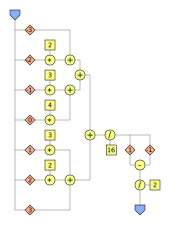

# HLS Dataflow Template Library
A header only HLS dataflow template library to implement algorithms at compile-time on FPGAs as deep pipelined dataflow graph.

## Introduction

The Template Library was designed to describe an algorithm as a data flow graph consisting of arcs and nodes. The nodes are arithmetic operators and the arcs are implemented as first in, first out buffer (FIFO). In this picture, the arcs are variables of type HLSVar, and operators like addition, multiplication, and more are the nodes. An arithmetic node is a circle, a constant node is a square, the offset operator is a diamond, and at the edge of the graph are the input and output nodes. An example graph with corresponding source code is shown below. The graph shows a simple peak finder algorithm which consists of a 7-point average smooth filter and a derivation.



```cpp
component int11 peak_finder_adc(uint10 stream_in)
{
	static HLSVar<uint14,3,-3> triangular_stream_buffer;
	triangular_stream_buffer = stream_in;
	static HLSVar<uint14,1,-1> smoothed_stream;
	smoothed_stream = (triangular_stream_buffer.offset(-3) + Token<uint14>(2)*triangular_stream_buffer.offset(-2)
			+ Token<uint14>(3)*triangular_stream_buffer.offset(-1) + Token<uint14>(4)*triangular_stream_buffer.offset(0)
			+ Token<uint14>(3)*triangular_stream_buffer.offset(+1) + Token<uint14>(2)*triangular_stream_buffer.offset(+2)
			+ triangular_stream_buffer.offset(+3))/Token<uint14>(16);
	static HLSVar<int11> derivative;
	derivative = ( smoothed_stream.offset(-1) - smoothed_stream.offset(1) ) / Token<int2>(2);
	int11 result = derivative.offset(0).value;
	return result;
}
```

Variables of type HLSVar are static stream buffers holding more than one data item at the same time and act as FIFO as mentioned above. The FIFO buffer is formed in a maximum offset value and a minimum offset value, which means that the index space goes from negative minimum offset over index zero to the positive maximum offset. Reading from the HLSVar stream variable is always from offset 0.

```cpp
HLSVar<type,maxOffset,minOffset>
```
The basic data type of the HLSVar buffer is a token, which is a struct of the basic data type and a valid bit. An assignment shifts a token into the steam on the left side of the assignment only when the token on the right side is valid.

A data item is streamed in and processed for each function invocation. The Intel HLS compiler pipelines a component function by default, with the result that the function can be invoked again before the return value of the previous call is valid. In this context, the way we use the HLSVar buffers ensure that memory access conflicts are prevented, and we always get an initiation interval of II=1 which esures a maximal througput.